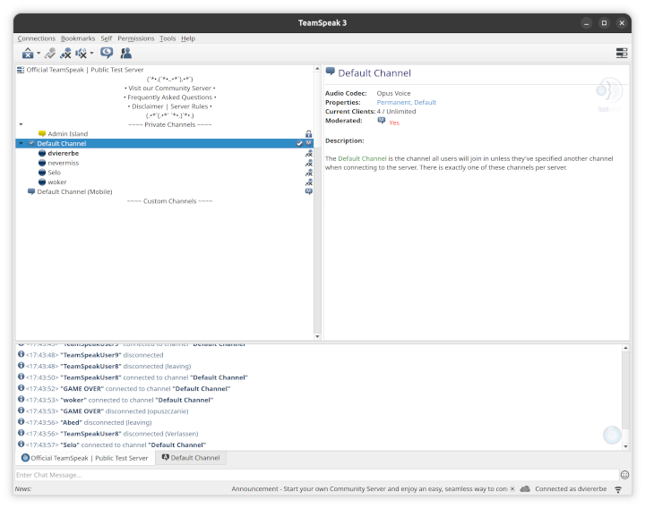

# (UNOFFICIAL) TeamSpeak 3 Client Snap

This is an **UNOFFICIAL** snap for the TeamSpeak3 Voice Communication Client.

TeamSpeak3 is a Voice over Internet Protocol (VoIP) application that allows users to speak on public Internet servers. It's widely used for gaming, business communication, and social purposes.



## Reporting an Issue/Expectations

If you experience any issues with this snap, [open an issue](https://github.com/dviererbe/teamspeak3-client-snap/issues/new), but please be aware that I can only try fixing issues related to the snap packaging. I can not fix any issues with the TeamSpeak 3 Client software itself. In these cases you should [contact](https://teamspeak.com/en/more/contact/) the developers directly.

Please also take into consideration that I packaged this software to use it myself. I will try doing my best in my free time to resolve issues with this snap, but I do not get paid to maintain this snap and I am not commited to make any promises/guarantees. Feel free to send pull requests or fork this repo if you think you can do better ;)

## Installing the Snap

```
sudo snap install teamspeak3-client
```

## Building the Snap

0. (Prerequisite) install Snapcraft:
   ```
   sudo snap install snapcraft
   ```
1. (optional) clean the cache from a previous build:
   ```
   snapcraft clean
   ```
2. build the Snap:
   ```
   snapcraft pack
   ```
3. install the Snap:
   ```
   snap install --dangerous ./teamspeak3-client_*_amd64.snap
   ```

## License

- The files in this repository are licensed under the [MIT License](./LICENSE).
- The TeamSpeak 3 Client and the logo in `snap/gui/teamspeak3-client.png` are propriatary software/assets (see [license](./assets/teamspeak3-client-license.txt)).
